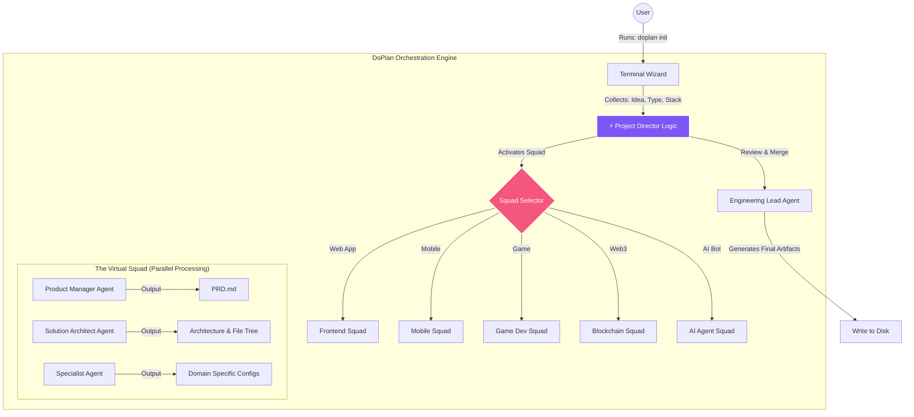
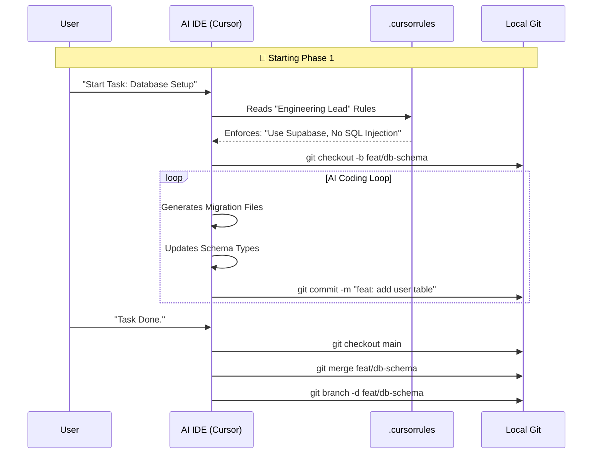

# Technical Architecture
## DoPlan CLI v1.0

**Version**: 1.0  
**Status**: Draft  
**Last Updated**: November 2025  
**Owners**: Engineering Lead, System Architect

---

## DoPlan: Technical Architecture & Specification

DoPlan is a Go 1.21+ single-binary CLI that behaves as a “Context Pre-loader” for AI-assisted development. It orchestrates a virtual hierarchy of agents to produce documentation, architectural scaffolding, and prompts before the user opens their IDE.

### Core Architecture Snapshot

- **Language**: Go (Golang) 1.21+
- **Distribution**: Single binary (`doplan`)
- **Primary Function**: Scaffold a battle-ready project optimized for Cursor, Windsurf, Cline, etc.

| Concern | Library |
| --- | --- |
| CLI Framework | `github.com/spf13/cobra` |
| TUI Wizard | `github.com/charmbracelet/bubbletea` |
| Styling | `github.com/charmbracelet/lipgloss` |
| Config | `github.com/spf13/viper` |
| AI Client | `github.com/sashabaranov/go-openai` |

### System Orchestration Flow



### DoPlan Git Workflow

DoPlan enforces a strict branch-per-task strategy:

1. **Define**: User selects a task from `TASKS.md`.
2. **Branch**: CLI/IDE creates context-aware branch (`feat/auth-flow`, `task/TASK-053`, etc.).
3. **Code**: Agents implement within the provided rules.
4. **Verify**: Tests and quality gates run automatically.
5. **Merge**: Branch merges back; task is checked off.



### Generated Folder Structure (Legacy Reference)

The historic `.doplan/` layout informed the current `.plan/` structure. Original scaffold:

```
my-new-project/
├── .doplan/                 # DoPlan state (hidden)
│   ├── history.json         # Chat log with "Director"
│   └── backup/              # Previous PRD versions
├── .cursorrules             # IDE brain (Cursor/Windsurf/Cline)
├── .github/workflows/       # CI/CD pipelines
├── docs/
│   ├── PRD.md               # Generated by PM agent
│   ├── ARCHITECTURE.md      # Generated by Architect agent
│   ├── DESIGN.md            # Generated by Design agent
│   └── TASKS.md             # Generated by Eng Lead (checklist)
├── src/                     # Scaffolded code directories
└── README.md
```

Our modern `.plan/` hierarchy (see Phase 5 tasks) is the evolution of this structure for richer phase/feature planning.

### Implementation Roadmap Alignment

- **Phase 1 – Skeleton**: Cobra CLI, BubbleTea wizard, generator scaffolding.
- **Phase 2 – Brain**: Agent definitions, persona loading, OpenAI orchestration.
- **Phase 3 – Specialist Squads**: Dynamic persona switching per project type (e.g., Solidity security for Web3).

These align directly with the existing task matrix and backlog additions (Section 5 of this doc).

---

## 🏗️ System Overview

DoPlan CLI is a single-binary Go application that generates complete project structures. The architecture is designed for:
- **Simplicity**: Minimal dependencies, clear structure
- **Performance**: Fast generation (< 5 seconds)
- **Maintainability**: Modular design, comprehensive tests
- **Extensibility**: Easy to add new project types, agents, commands

---

## 📦 Module Structure

```
doplan/
├── cmd/doplan/
│   └── main.go              # Entry point, CLI initialization
├── internal/
│   ├── cli/
│   │   └── root.go          # Cobra CLI root command setup
│   ├── tui/
│   │   └── wizard.go        # Bubbletea TUI wizard implementation
│   ├── generator/
│   │   ├── generator.go     # Main orchestration logic
│   │   ├── agents.go         # Agent markdown generation
│   │   ├── commands.go       # Command markdown generation
│   │   ├── plan.go          # .plan/ structure generation
│   │   ├── ide.go           # IDE config file generation
│   │   ├── boilerplate.go   # Source code boilerplate generation
│   │   ├── github.go        # GitHub workflow generation
│   │   └── docs.go          # README, STANDUP, rules README generation
│   └── rules/
│       ├── rules.go         # Rules extraction (embed.FS)
│       └── library/         # Embedded rules (500+ files)
└── pkg/models/
    └── project.go           # Data models (ProjectRequest, ProjectState)
```

---

## 🔧 Technology Stack

### Core Dependencies
```go
require (
    github.com/charmbracelet/bubbletea v1.3.4  // TUI framework
    github.com/charmbracelet/lipgloss v1.1.0   // Styling for TUI
    github.com/spf13/cobra v1.8.0             // CLI framework
)
```

### Standard Library Usage
- `embed` - Embed rules library in binary
- `text/template` - Generate markdown files from templates
- `compress/gzip` - Compress embedded rules (optional)
- `encoding/json` - State management
- `os`, `path/filepath` - File system operations
- `fmt`, `log` - Logging and output

### Build Tools
- Go 1.21+ (required)
- `-ldflags="-s -w"` - Strip debug info for smaller binary
- UPX (optional) - Further compression if needed

---

## 🎨 Architecture Patterns

### 1. Generator Pattern
Each component (agents, commands, rules, etc.) has a dedicated generator function:
```go
type Generator interface {
    Generate(project *models.Project) error
}
```

**Benefits**:
- Clear separation of concerns
- Easy to test individually
- Simple to extend with new generators

### 2. Template-Based Generation
All markdown files generated from Go templates:
```go
const agentTemplate = `# {{.Name}}

## Role
{{.Role}}

## System Prompt
{{.SystemPrompt}}
...
`
```

**Benefits**:
- Consistent formatting
- Easy to modify templates
- No hardcoded strings

### 3. Embedded Resources
Rules library embedded using `embed.FS`:
```go
//go:embed library/*
var rulesFS embed.FS
```

**Benefits**:
- Zero external dependencies
- Works offline
- Versioned with binary

### 4. State Management
Simple JSON file for project state:
```go
type ProjectState struct {
    Phase       string   `json:"phase"`
    ActiveTask  *int     `json:"active_task"`
    ActiveBranch *string `json:"active_branch"`
    Completed   []int    `json:"completed"`
    Locked      bool     `json:"locked"`
}
```

**Benefits**:
- No database needed
- Human-readable
- Easy to debug

---

## 🔄 Data Flow

### Project Generation Flow
```
User Input (TUI)
    ↓
ProjectRequest (models)
    ↓
Generator.Orchestrate()
    ↓
├── GenerateDirectoryStructure()
├── GenerateAgents()
├── GenerateCommands()
├── GeneratePlanStructure()
├── GenerateIDEConfigs()
├── GenerateBoilerplate()
├── ExtractRulesLibrary()
├── GenerateGitHubWorkflows()
└── GenerateDocumentation()
    ↓
Project Created
    ↓
Success Message
```

### Command Execution Flow (Future - in generated projects)
```
User types /tell
    ↓
Command parser (in IDE)
    ↓
Reads .cursor/commands/tell.md
    ↓
Activates Project Orchestrator agent
    ↓
Reads .cursor/agents/project-orchestrator.md
    ↓
Executes action (writes to IDEA.md)
    ↓
Updates active_state.json
```

---

## 📁 File Generation Strategy

### 1. Directory Structure
- Create all directories first
- Validate permissions
- Handle existing directories gracefully

### 2. Template Rendering
- Load templates from embedded strings
- Render with project-specific data
- Write to files atomically (temp file → rename)

### 3. Batch Operations
- Group file writes by directory
- Minimize disk I/O
- Use buffered writes

### 4. Error Handling
- Validate inputs before generation
- Rollback on critical errors
- Provide clear error messages

---

## 🚀 Performance Optimization

### Binary Size Optimization
1. **Compression**: Use `compress/gzip` for embedded rules
   ```go
   // Compress rules at build time
   // Decompress at runtime
   ```
2. **Selective Embedding**: Only embed essential rules in MVP
3. **Strip Debug Info**: `-ldflags="-s -w"`
4. **Target**: 10-12MB (leaves room for growth)

### Generation Speed Optimization
1. **Parallel Generation**: Generate independent files concurrently
2. **Batch Writes**: Group file operations
3. **Template Caching**: Pre-compile templates
4. **Target**: < 5 seconds for full project

### Memory Optimization
1. **Streaming**: Process files one at a time, don't load all into memory
2. **Lazy Loading**: Only load what's needed
3. **Target**: < 100MB peak memory

---

## 🔐 Security Considerations

### Input Validation
- Sanitize project names (alphanumeric + hyphens/underscores only)
- Validate paths to prevent directory traversal
- Check file permissions before writing

### File System Security
- Never write outside project directory
- Validate all file paths
- Use `filepath.Join` for path construction
- Check for symlinks (prevent following)

### No Arbitrary Code Execution
- No `exec.Command` calls
- No dynamic code generation
- All output is static files

### Secrets Management
- No secrets in code
- No API keys or tokens
- All configuration in generated files (user's responsibility)

---

## 🧪 Testing Strategy

### Unit Tests
- Test each generator independently
- Mock file system operations
- Test template rendering
- **Target**: 80%+ coverage

### Integration Tests
- Test full project generation flow
- Test with different project names
- Test with different IDE selections
- Test error scenarios

### Performance Tests
- Benchmark generation time
- Benchmark binary size
- Memory profiling

### Test Structure
```
internal/
├── generator/
│   ├── agents.go
│   ├── agents_test.go
│   ├── commands.go
│   ├── commands_test.go
│   ...
```

---

## 📊 State Management

### active_state.json Structure
```json
{
  "phase": "idea|brainstorm|writing|approved|tasks|building",
  "active_task": null | task_id,
  "active_branch": null | "task/TASK-053-error-messages",
  "completed": [task_ids],
  "locked": false | true
}
```

### State Transitions
```
idea → brainstorm → writing → approved → tasks → building
```

### State Updates
- Atomic writes (temp file → rename)
- Validate state before updates
- Provide clear error messages on invalid transitions

---

## 🔌 Extensibility Points

### Adding New Project Types
1. Create new generator in `internal/generator/boilerplate.go`
2. Add project type to `ProjectType` enum
3. Update TUI wizard (if needed)
4. Add templates for new type

### Adding New Agents
1. Add agent definition to `internal/generator/agents.go`
2. Update agent hierarchy
3. Agent file automatically generated

### Adding New Commands
1. Add command definition to `internal/generator/commands.go`
2. Command file automatically generated

### Adding New Rules
1. Add rule file to `internal/rules/library/`
2. Rule automatically embedded and extracted

---

## 🌐 Distribution Architecture

### npx Wrapper Strategy
```
npm package: doplan
├── package.json
│   └── bin: "doplan.js"
└── doplan.js (Node.js script)
    ├── Detects OS/arch
    ├── Downloads binary from GitHub Releases
    ├── Caches in ~/.doplan/bin/
    └── Executes binary
```

### Binary Hosting
- GitHub Releases for all platforms
- Assets: `doplan-darwin-amd64`, `doplan-darwin-arm64`, `doplan-linux-amd64`, `doplan-linux-arm64`, `doplan-windows-amd64.exe`
- Versioned releases (semantic versioning)

### Update Strategy
- Check GitHub Releases API for updates
- Optional `--update` flag
- Cache binary after first download
- Verify binary checksums

---

## 📈 Scalability Considerations

### Current Scale (v1.0)
- Single binary, local execution
- No network calls after download
- No database or external services
- Handles 1 project at a time

### Future Scale (if needed)
- Could add project templates API
- Could add rules library updates
- Could add analytics (opt-in)
- All optional, not required for core functionality

---

## 🐛 Error Handling Strategy

### Error Types
1. **Validation Errors**: Invalid input (show immediately)
2. **File System Errors**: Permission issues, disk full (clear message + suggestion)
3. **Template Errors**: Malformed templates (log + graceful degradation)
4. **State Errors**: Invalid state transitions (prevent + explain)

### Error Messages
- Human-readable (no stack traces for users)
- Actionable (suggest what to do next)
- Contextual (explain why error occurred)

### Logging
- Optional `--verbose` flag for debugging
- Log to stderr (not stdout)
- Include timestamps and context

---

## 📚 Code Organization Principles

1. **Separation of Concerns**: Each package has single responsibility
2. **Dependency Injection**: Pass dependencies explicitly
3. **Interface-Based Design**: Use interfaces for testability
4. **Error Propagation**: Wrap errors with context
5. **Documentation**: Comprehensive comments and README

---

## 🔄 Future Architecture Considerations

### Potential Enhancements
- Plugin system for custom generators
- Configuration file for user preferences
- Project templates marketplace
- Rules library auto-updates
- Multi-project management

## 🔮 Upcoming Workflow Enhancements

### `/plan` Command & Planning Hierarchy
- Extend `internal/generator/plan.go` to scaffold multi-phase directories (e.g., `01-Foundation/01-Project_Init/`)
- Auto-generate feature templates (`design.md`, `plan.md`, `tasks.md`, `prompts.md`, `github.md`) plus `contracts/` for shared schemas
- Ensure new scaffolding ties back into `active_state.json` and TASKS so agents see per-feature context

### Branch & Task Automation
- Add git helpers (likely in `internal/generator/github.go` or new package) that create/switch `task/TASK-###` branches when `/build` or `/finished` runs
- Update `/finished` workflow to auto-update TASKS.md progress, recalc percentages, and write back to `active_state.json`
- Emit branch metadata so scan reports and `/progress` can display the active branch

### Scan Diffing & State History
- Store previous scan metadata under `.plan/reports/` (JSON companion) to diff against new scans
- Capture state history snapshots for `.plan/active_state.json` inside `.plan/history/state-*.json` and expose rollback helpers via `scripts/statehistory`
- Update scan generator to surface deltas (new files, dependencies, coverage, tasks) automatically **and** append the latest state-history summary so scans explain phase/task/branch changes

### Feedback, GitHub, and CI/CD Integrations
- Introduce `/feedback` command wiring that persists entries and optionally syncs with the CLI’s GitHub repo
- Auto-detect git remotes, open issues/milestones, and keep repo metadata aligned with PRD/ROADMAP content
- Generate task-aware GitHub Actions/branch-protection templates so each branch inherits consistent CI/CD

### Rich Reporting & Templates
- Create a reporting engine (likely under `internal/generator/docs.go`) that can inject visuals, charts, and dependency vulnerability data
- Allow teams to extend scan templates via configuration, reusing the same generator interfaces
- Ensure new outputs stay embedded/offline by default, matching the existing architecture principles

### Documentation Layout Enforcement
- Generator must create a top-level `Docs/` folder (capital “D”) with the canonical categories: `foundation/`, `features/`, `release/`, `history/`.
- `/plan` and `/write` flows should deposit feature-specific specs into `Docs/features/<Feature_Name>/` and update `Docs/README.md`.
- Add lint/validation so root-level `.md` files (beyond `README.md` & `CHANGELOG.md`) are rejected; new docs must live under `Docs/`.

### Design Decisions
- Keep it simple (no over-engineering)
- Prefer standard library over external deps
- Make it easy to extend
- Maintain backward compatibility

---

**Document Status**: ✅ Complete  
**Next Step**: Review and approve, then type `/good` to lock plan and generate tasks.
